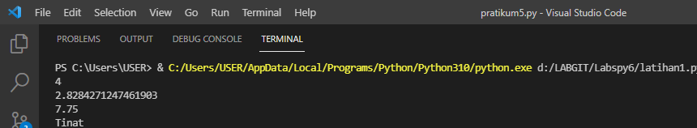

# Labspy6
## 1. Latihan : Lambda
Ubahlah kode dibawah ini menjadi fungsi menggunakan lambda. <p>

```bash
import math
def a(x):
    return x**2

def b(x, y)
    return math.sqrt(x**2 + y**2)  

def c(*args):
    return sum(args)/len(args)

def d(s):
    return "".join(set(s))
```

<li> Penjelasan </li>

1. Untuk memperluas daftar fungsi matematika gunakan import math <p>

2. Fungsi lambda yang menggunakan variabel a-d <p>


```bash
def a(x):
    return x**2
    a = lambda x : x ** 2
print(a(2))

def b(x, y):
    return math.sqrt(x**2 + y**2)
    b = lambda x, y : x ** 2  + y ** 2
print(b(2, 2))

def c(*args):
    return sum(args)/len(args)
    c = lambda *args : sum(args)/len(args)
print(c(5, -1, 8, 19))

def d(s):
    return "".join(set(s))
    d = lambda s: "".join(set(s))
print(d("Titan"))
```

3. Pemanggilan function lambda

```bash
print(a(2))
print(b(2, 2))
print(c(5, -1, 8, 19))
print(d("Titan"))
```

<li> Output </li>



## 2. Tugas : Tampilkan Menu Pilhan (Tampilkan Data ,Tambah Data ,Ubah Data(nama) ,Hapus Data(nama) , Flowchart)

<li> Penjelasan </li>

1. Membuat dictionary kosong yang nantinya akan diinput dengan data. <p>

```bash
data={}
```

2. Membuat perulangan dengan while dan terdapat pilihan menu untuk menjalankan program. <p>

```bash
while True:
print()
a=input("[(L)ihat, (T)ambah, (U)bah, (H)apus, (C)ari, (K)eluar] :")
print()
```

3. Menambahkan data nim, nama, nilai tugas, uts, dan uas. Data yang diinputkan akan masuk ke dalam dictionary data dengan nim sebagai keys sedangkan nama, tugas, uts dan uas sebagai values. <p>

```bash
if a=="t" or a=="T":
    print(" TAMBAH DATA ")
    print("-------------")
    nim=int(input("NIM\t: "))
    nama=input("Nama\t: ")
    tugas=int(input("Tugas\t: ")) 
    uts=int(input("UTS\t: "))
    uas=int(input("UAS\t: "))
    akhir=(int(tugas)*30/100)+(int(uts)*35/100)+(int(uas)*35/100)
    data[nim]=nama, tugas, uts, uas, akhir
```

Output Menambahkan Data <p>


4. Menampilkan atau melihat data. Jika sebelumnya belum menginput data, maka tampilannya akan "Tidak ada data". Apabila sudah menginput data, maka data yang telah diinput tadi akan ditampilkan. <p>

```bash
elif a=="l" or a=="L":
    if data.items():
        print(" DAFTAR NILAI ")
        print("--------------")
        print(72*"=")
        print("| {0:^10} | {1:^10} | {2:^6} | {3:^6} | {4:^6} |   {5:^12}  |".format("NIM", "NAMA", "TUGAS", "UTS", "UAS", "NILAI AKHIR"))
        print(72*"=")
        for item in data.items(): 
            print("| {0:>10} | {1:>10} | {2:>6} | {3:>6} | {4:>6} |   {5:>12}  |".format(nim, nama, tugas, uts, uas, akhir))
            print(72*"=")
        print()
    else:
        print(" DAFTAR NILAI ")
        print("--------------")
        print(72*"=")
        print("| {0:^10} | {1:^10} | {2:^6} | {3:^6} | {4:^6} |   {5:^12}  |".format("NIM", "NAMA", "TUGAS", "UTS", "UAS", "NILAI AKHIR"))
        print(72*"=")
        print("|                             TIDAK ADA DATA                           |")
        print(72*"=")
        print()
```

Output Menampilkan Data <p>


5. Apabila ingin mengubah data, maka anda akan diminta untuk menginputkan nim terlebih dahulu. Setelah itu input data yang ingin diubah. <p>

```bash
elif a=="u" or a=="U":
    print(" UBAH DATA ")
    print("-----------")
    b=input("Masukkan NIM anda: ")
    print()
    if data.keys():
        tugas=int(input("Tugas\t: ")) 
        uts=int(input("UTS\t: "))
        uas=int(input("UAS\t: "))
        akhir=(int(tugas)*30/100)+(int(uts)*35/100)+(int(uas)*35/100)
```

Output Mengubah Data <p>


6. Jika ingin menghapus data, anda akan diminta untuk menginput nim. Lalu data yang telah diinput diawal tadi akan dihapus beserta valuesnya (nama, nilai tugas, nilai uts dan nilai uas). <p>

```bash
elif a=="h" or a=="H":
    print(" HAPUS DATA ")
    print("------------")
    b=input("Masukkan NIM anda: ")
    print()
    if data.keys():
        del data[nim]
```

Output Menghapus Data <p>


7. Apabila ingin mencari data, anda akan diminta untuk menginput nim kemudian data yang anda cari akan muncul berdasarkan nim yang diinput tadi. <p>

```bash
elif a=="c" or a=="C":
    print(" CARI DATA ")
    print("-----------")
    b=input("Masukkan NIM anda: ")
    print()
    if data.keys():
        print(72*"=")
        print("| {0:^10} | {1:^10} | {2:^6} | {3:^6} | {4:^6} |   {5:^12}  |".format("NIM", "NAMA", "TUGAS", "UTS", "UAS", "NILAI AKHIR"))
        print(72*"=")
        print("| {0:>10} | {1:>10} | {2:>6} | {3:>6} | {4:>6} |   {5:>12}  |".format(nim, nama, tugas, uts, uas, akhir))
        print(72*"=")
        print()
```

8. Jika data sudah selesai diinput, pilih menu 'k'/'K' maka program akan terhenti. <p>

```bash
elif a=="k" or a=="K":
     break
```

Flowchart <p>
Output Menampilkan Data <p>


## Sekian Terima Kasih